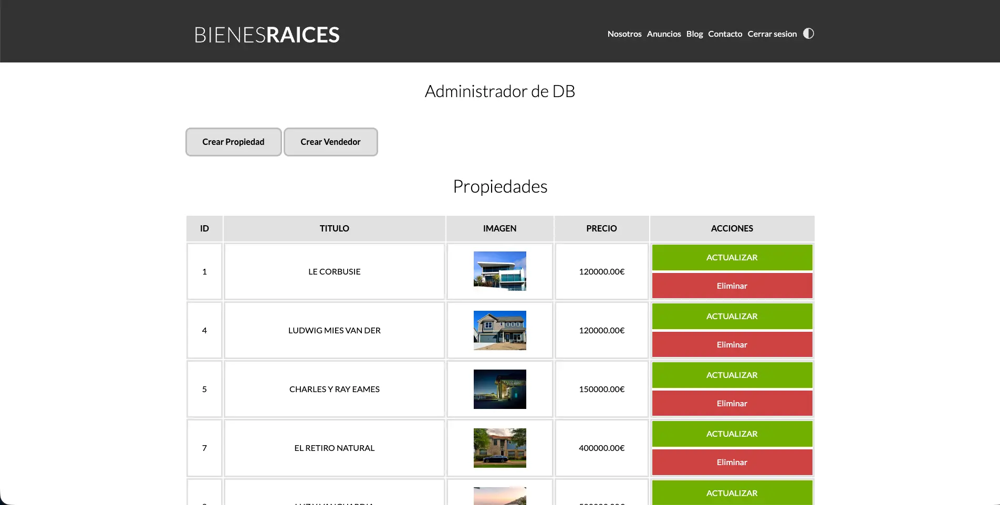

<table width="100%" align="center">
  <tr>
    <td align="center" valign="middle">
      
      <h1>🏠 Bienes Raíces - CMS Inmobiliario</h1>
      
<b>Plataforma de Gestión Inmobiliaria con Arquitectura MVC Robusta</b>

      

      
PHP 8 | Active Record | MySQL | SASS | Gulp

    </td>
  </tr>
</table>

<table>
  <tr>
    <td width="50%">
      

        
      

    </td>
    <td width="50%">
      

        
      

    </td>
  </tr>
  <tr>
    <td width="50%">
      

        
      

    </td>
    <td width="50%">
      

        
      

    </td>
  </tr>
</table>

## Visión General

**Bienes Raíces MVC** es un sistema de gestión de contenidos (CMS) diseñado a medida para el sector inmobiliario. Permite a las agencias administrar su inventario de propiedades y vendedores de manera centralizada, ofreciendo al mismo tiempo un frontend público optimizado para la captación de clientes.

El proyecto destaca por su **seguridad y validación**: desde la sanitización de entradas para prevenir inyecciones SQL hasta el manejo seguro de la subida de archivos (imágenes de propiedades) en el servidor.

---

## Stack Tecnológico y Justificación Técnica

Este proyecto evita el uso de frameworks pesados para demostrar el dominio de los fundamentos de la web y el patrón de diseño MVC.

| Tecnología | Implementación y Justificación en el Proyecto |
| :--- | :--- |
| **PHP 8 (Custom MVC)** | Orquesta la aplicación separando estrictamente la lógica de negocio (Modelos), la presentación (Vistas) y el manejo de peticiones (Controladores). Esto facilita la escalabilidad y el mantenimiento del código. |
| **Active Record (ORM)** | Implementación manual del patrón Active Record. Mapea las tablas de `Propiedades` y `Vendedores` a clases PHP, permitiendo realizar operaciones CRUD completas sin escribir SQL repetitivo y reduciendo la deuda técnica. |
| **MySQL** | Base de datos relacional normalizada. Se diseñó para manejar la integridad referencial entre propiedades y vendedores, asegurando que no existan datos huérfanos. |
| **Intervention Image** | Librería integrada para el procesamiento de imágenes en el backend. Permite redimensionar y optimizar las fotos subidas por los administradores antes de guardarlas, ahorrando espacio en disco y mejorando la velocidad de carga. |
| **SASS (BEM)** | Preprocesador CSS utilizado con la metodología **BEM (Block Element Modifier)**. Esto garantiza que los estilos de las tarjetas de propiedad y formularios sean modulares y no generen conflictos de especificidad. |
| **JavaScript** | Utilizado para mejorar la experiencia de usuario (UX) mediante validaciones de formularios en el cliente y la interactividad del menú responsive (Dark Mode / Mobile Menu). |

---

## Desafíos Técnicos Resueltos

### 1. Sistema de Upload de Archivos Seguro
El manejo de imágenes es crítico. Implementé una lógica que:
* Genera nombres únicos (hash) para evitar colisiones de archivos.
* Valida tipos MIME para asegurar que solo se suban imágenes reales.
* Elimina automáticamente las imágenes antiguas del servidor cuando una propiedad es actualizada o borrada, evitando "basura" en el almacenamiento.

### 2. Abstracción de Base de Datos
Creé una clase padre `ActiveRecord` que utiliza **static binding** para heredar métodos comunes (`find`, `save`, `delete`) a cualquier modelo nuevo. Esto significa que si mañana necesito añadir un modelo "Blog", hereda automáticamente toda la funcionalidad CRUD sin escribir una sola línea de SQL.

### 3. Sincronización de Datos (Hydration)
Implementé un algoritmo para sincronizar los datos provenientes de `$_POST` con los objetos en memoria antes de guardarlos. Esto permite mantener el estado de los formularios en caso de error de validación, mejorando significativamente la usabilidad para el administrador.